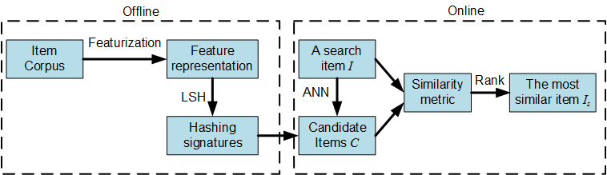
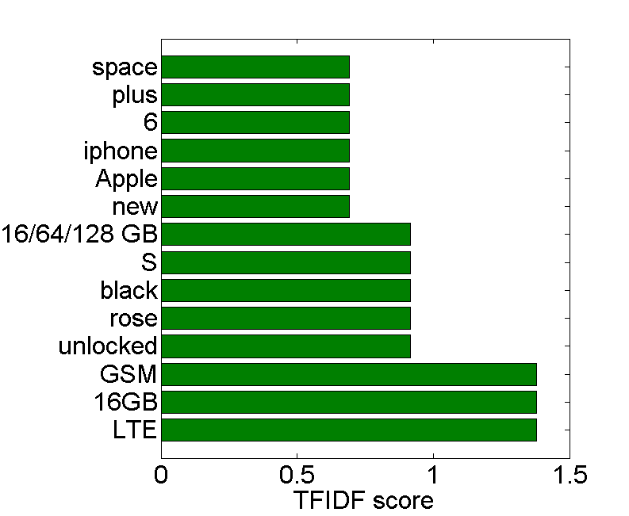
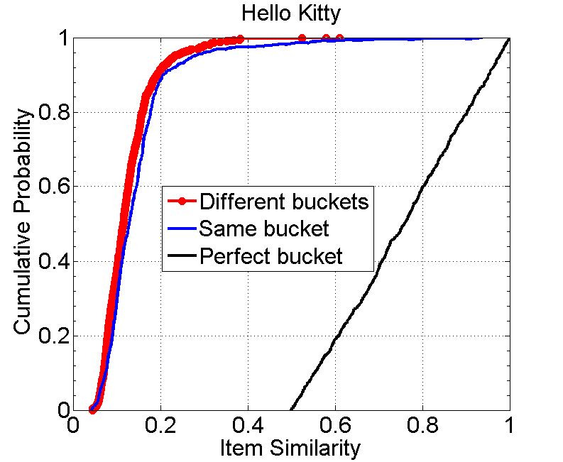
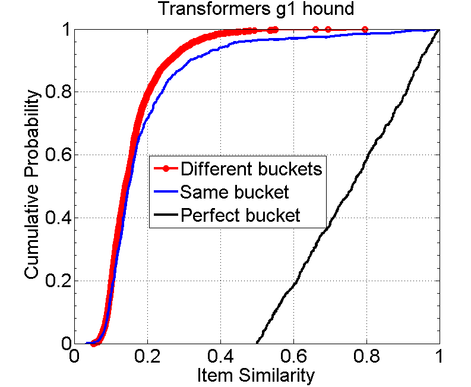
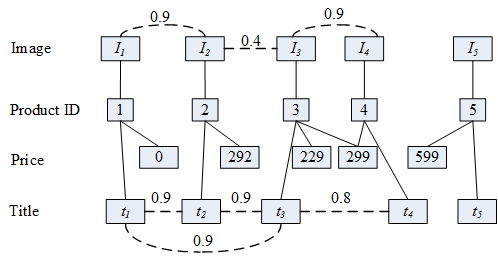

# Product-Deduplication
A practical implementation for product deduplication using TFIDF and Super Bit LSH

# Table of Content
- [Framework Overview](#framework-overview)
- [Compile and Usage](#compile-and-usage)
- [Code Documentation](#code-documentation)
- [Simple Analytic Results](#simple-analytic-results)
- [Future Works](#future-works)

Framework Overview
==================

Given a query *q*, a list of search results *L* where each item *I* ∈ *L* denotes a product that is relevant to the query *q*. For each item *I* ∈ *L*, the goal of this project is to return the most similar item *I**s* ∈ *L* to *I*.

Note that the similarity of product items could have different interpretations. For instance, we may focus on finding the same product with different settings (e.g., iphone 7 64GB memory versus iphone 7 128GB memory, black dress versus white dress), or even more restrict, the same product with the same setting, or the same product, the same setting, and sold by the same seller. In this project, we do not have an exact requirement for similarity, but just focus on returning the most similar ones. For example, if we could not find the same product, we may just return the most related ones such as from the same category or from the same manufacturer.

 

The overview of this project is shown in Figure . We first perform featurization so that each item *I* is represented as a vector of features. Next, we index each items with Locality Sensitive Hashing (LSH), more specially, the Super-Bit Locality-Sensitive Hashing  so that two similar items in terms of feature representations would have higher probability of falling into the same bucket. With the LSH, given a search item *I*, we are able to quickly identify a candidate set *C* of similar items to *I* (approximate nearest neighbors ANN). Finally, for each item *I**j* ∈ *C*, we compute its similarity towards the search item *I* and return the most similar one.

Featurization
-------------

Given a product item, we could extract various features to represent this item such as word tokens from its title, description, price, condition, shipping information, selling information, manufacturer information, location, image, category and so on. Definitely not every feature is of the same importance. For instance, a word token “unlocked" is more informative than another word token “screen" for iphone product items. We could either perform feature selection such as maximizing mutual information , gradient booster feature selection , or learn a better representation such as matrix factorization including PCA  and NMF  or auto-encoding . Unfortunately, we do not have any training corpus available to perform supervised feature selection or supervised feature representation learning. In addition, the total number of data samples (only 100) is not large enough to learn a good quality of feature representation. We thus opt to use a simple heuristic, TFIDF, to weight the importance of different features. Specifically, we chose to only use the title information (description information will be very useful but it is not available), and represent each item as a vector of terms extracted from titles of the entire item corpus. The importance of each term is weighted using the TFIDF score. Condition and price is also very useful and we will discuss how we utilize them later in Section .

Locality Sensitive Hashing
--------------------------

Locality-sensitive hashing (LSH)[2] method aims to hash similar data samples to the same hash code with high probability. In this project, we utilize LSH in terms of two purposes:

1.  Near duplication detection: For each item, LSH is able to find the set of items that have near-duplicate feature representations.

2.  Reduce all-pair similarity computation: For each item, we utilize LSH to quickly compute a set of candidate similar items. Instead of computing all-pair similarity, for each item, we only need to compute the similarity between this item and another item from the candidate similar item set.

But LSH also has limitations: it may lead to low recall since it only finds out near duplication items. Therefore, we only utilize title information to obtain feature representation so that we could obtain a larger candidate pool (items with similar title). In addition, instead of directly using LSH to estimate the similarity or return the ANN result as the most similar item, we will compute a more accurate similarity score using the similarity metric presented in the following.

Similarity Metrics
------------------

Given a pair of items *I**i* and *I**j*, definitely we could simply define the similarity using any similarity metrics (e.g, cosine similarity, Jaccard) over the feature vector space. However, since our feature vector representation is very limited (only using terms from title), here we would like to take advantage of other valuable information to obtain a better similarity metric. Specifically, we define the similarity between items *I**i* and *I**j* as:

sim(*I**i*, *I**j*)= 0.5*cos(v(*I**i*), v(*I**j*))+0.4*Jaccard(v(*I**i*), v(*I**j*)) + 0.1(1 - |p(*I**i*)-p(*I**j*)|/max(p(*I**i*), p(*I**j*)))

 where *v*(*I*) denotes the feature vector of an item *I* and *p*(*I*) denotes the price of an item *I*.
 
Compilation and Usage
=====================

Environment and Library
-----------------------

This program requires python and Java JDK 1.7. It has been tested under both Max OS, Windows, and virtual machine using Linux. All the required libraries are stated in Section .

Compile and Usage
-----------------

To compile the source code into an executable jar file, we could use any IDE tool to generate a jar file. I used the IDE IntelliJ.

Our Program accept 3 arguments. They should follow required order. The first argument is the keyword to search (String). If the keyword has whitespace, please make sure that you use **double quotes “"** to quote them. The second argument is the de-duplication option (Boolean). We notice that the search result returned by the API contain duplicated items. If the option is true, we will merge items with the same item ID as a single item. That is, the unique identifier is the item ID. If the option is false, we consider the unique identifier is the position of item in the search result. Therefore, although two items have the same item ID, we consider they are two different ones. The third parameter is the number of buckets (Integer). Both the second and third arguments are optional, by default we set the de-duplication by ID as true and the number of buckets as 3. For instance, if the search keyword is “Hello Kitty", please type:

    java -jar ItemSim.jar "Hello Kitty"
     

Or

    java -jar ItemSim.jar "Hello Kitty" false
     

Or

    java -jar ItemSim.jar "Hello Kitty" false 10

Alternatively, we could simply run the “run.sh" with parameters to execute the program.

    ./run.sh "Hello Kitty"

**Note that the API Key setting Json file and the call\_ebay\_api.py should be put in the same directory of the executable jar file.** For the searchout folder, it should be placed in the same directory of the executable jar file. However, currently if no “searchout" folder exits, the program will automatically create this folder.
Code Documentation
==================

Code Hierarchy
--------------
Java Class Documentation
------------------------

The detailed code documentation was located in the folder “JavaDoc". Here we just briefly highlight a set of functions that can be replaced or modified using different approaches.

-   **new featurization**: assume that we would like to represent each item as a vector of features using another featurization method. We then only need to modify the below function within ItemFeature.java

            public void TFIDF()
            

-   **new LSH implementation**: assume that we would like to use another LSH implementation, we then only need to modify the below function within ItemLSHIndex.java

              public void createLSH(int buckets)
              

-   **new similarity metric**: assume that we have a better similarity metric and would like to replace the current linear similarity metric defined in Eq. , we then only need to modify the below function within LinearSimilarity.java

              public double calculateSimilarityScore(Item a, SparseDoubleVector v1, Item b, SparseDoubleVector v2)
              

 
Simple Analytic Results
=======================

Does TFIDF Help?
----------------

 

Let us look at an illustrative example with query “iphone 6 plus" and 3 items in search results (see searchout/test\_iphone\_6\_plus.json). As shown in Figure , tokens with higher TFIDF scores (e.g., LTE) relatively provide more information than tokens with lower TFIDF scores (e.g., iphone). In the search results for “iphone 6 plus", we do expect every item would have the keyword “iphone" and thus sharing the term iphone does not help a lot in terms of identifying similar items. Therefore, it is intuitive that two items sharing tokens with higher TFIDF is more similar than another two iterms sharing tokens with lower TFIDFs.

The Quality of LSH
------------------

  

As shown in Figure , generally, items from the same bucket are more similar to that from different buckets. For instance, among all the items that are related to “Hello Kitty", 99% of item pairs that are from different buckets have similarity less than 0.4, while 96% of item pairs that are from the same bucket have similarity less than 0.4. In addition, the maximum similarity between item pairs that are from different buckets is around 0.6, while the maximum between item pairs that are from the same bucket is up to 0.96. Although the Cumulated Probability Curve of item similarity from the same bucket is still far from the perfect curve, it guarantee that two items with high similarity (e.g., above 0.6) won’t be divided into two separate buckets. We have observed similarly pattern for times that are related to “Transformer". Therefore, LSH does work for finding items with high similarity.
Future Works
============

Spell Normalization, POS Tagging and other NLP Pre-processing
-------------------------------------------------------------

In the current approach, it will consider “keychain" as one token, while “key chain" will be considered as two tokens“key" and “chain". Therefore, if we could perform spell normalization, or fuzzy TFIDF before LSH, we could obtain a larger candidate similar set for each item.

Another insight is that in the product domain, mostly the important words are nouns, noun phrases and adjectives. Therefore, if we could perform POS tagging, and only use tokens within certain categories (e.g., nouns, adjectives), we may obtain a better similarity measure.

Other Featurization
-------------------

As illustrated in Section , if we have a specific definition for “similar", a set of ground truths, we might go for supervised Featurization. A set of possible candidates are: gradient boost decision tree , or even popular deep learning techniques including auto-encoding (replicate neutral network ). If we have sufficient data and various candidate features, we could also use matrix factorization .

 

Multi-type Graph Clustering with Image Similarity
-------------------------------------------------

When a human is evaluating whether two products are similar or not, possibly the most important evidence she/he is looking for is whether the two images of products look similar or not. This motivates us to utilize the image similarity information to group similar products into the same cluster. As illustrated in Figure , we represent the data as a multi-type graph that consists of different types of nodes such as title nodes, price nodes and image nodes. Two title nodes are connected with weighted text similarity edges; while two image nodes are connected with image similarity edges. Furthermore, two different-type nodes are connected if they co-occurred with each other. With the multi-type graph representation [1], we aim to group product nodes with similar titles, prices and images into the same cluster .

Scalability
-----------

This program provides a very naïve implementation for each module. Although the current implementation does not work when the data are in large-scale, each module can be easily re-factorized to support large-scale data. For instance, the TFIDF computation (featurization module) is a very classic MapReduce job and can be easily distributed. The Super Bit LSH is very efficient and can be easily parallelized and distributed.

Reference
=========
[1] Unsupervised Entity Resolution on Multi-type Graphs. Linhong Zhu, Majid Ghasemi-Gol, Pedro Szekely, Aram Galstyan and Craig Knoblock. In International Sematic Web Conference (ISWC), 2016. 

[2] J. Ji, J. Li, S. Yan, B. Zhang, and Q. Tian. Super-bit locality-sensitive
hashing. In Advances in Neural Information Processing Systems, 2012.
